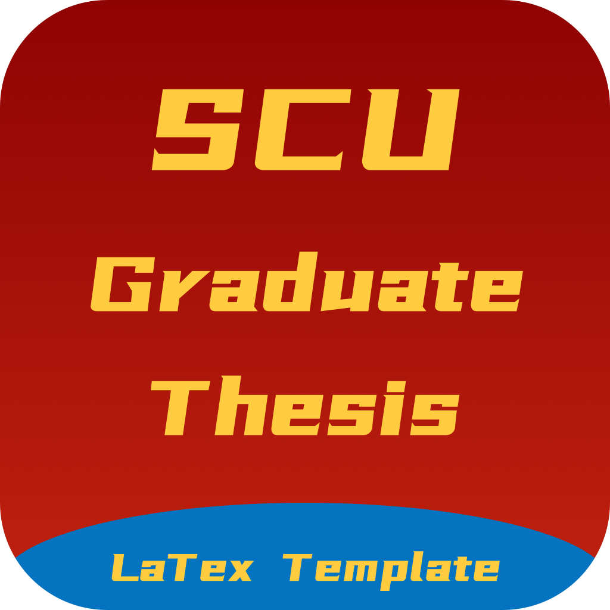

<div align="center"><p>
    <span style="font-size: 14px">Version: 2020.02.22</span><br>
    <span>"2020年四川大学研究生学业论文LaTex模版样式文件"</span><br>
    <span style="font-size: 12px;color= #95dafc">-- Modified by <a>Kevin T. Lee</a> --</span>
    </p>
   <a href="./License"></a>
        <a href="http://lidengju.com"></a>
     <a href="http://lidengju.com"></a>
    <a href="https://github.com/kevinleeex/scu_thesis_2020"></a>
</div>


# 四川大学2020研究生学业论文LaTex模版样式文件

> 根据学院给的Word模版2020版需求，并基于fork的旧版库样式，改写了模版。
>
> SCU graduate thesis latex template.

## DEMO

为了方便更新，将样式文件单独作为子模块。

完整的项目，请移步至[scu_thesis_2020](https://github.com/kevinleeex/scu_thesis_2020)

## :warning:NOTICE

现在发现几处给出范例与描述不一致，已根据理解修改，如下：

- 页眉说明为五号字，范例为小五，修改为**小五**。
- 一些标题描述间隔一个汉字符，范例为一个空格符，修改为**空格符**。
- 封面页校名标题没有居中，修改为**居中**。
- 描述中公式居中，范例为右对齐，添加右对齐功能，默认**居中**。
- 描述中图和表题注都为宋体加粗，范例的表为黑体，修改为**宋体加粗**。
- 描述中目录的节间距为段前6pt，段后0pt，范例为段前0pt，段后0pt，修改为**段前6pt**。
- 没有保留封面等内容的说明内容。
- 部分内容由于排版软件的关系有些微差别。

> 如您发现更多问题请您提交ISSUES，或PR。
>
> **免责声明：本项目开源用于格式参考，本模版的作者和贡献者不承担任何人使用该模版所引发的任何问题(如格式审查等)。**

## Features

- [x] 🍞 通过配置项自动生成不同类型的论文格式，你专注内容就好
- [x] 🍔 「像素级」复刻原Word模版
- [x] :beer:  通过```\incite``` 来进行行内引用
- [x] :apple: bicaption图片双语题注示例


## Options

| 参数         | 说明                       |
| ------------ | -------------------------- |
| professional | 专业学位                   |
| academic     | 学术学位                   |
| master       | 硕士                       |
| docter       | 博士                       |
| approval     | 送审版本，不生成声明和致谢 |
| color        | 红色川大logo，默认为黑色   |

## Release Notes

See [Releases](https://github.com/kevinleeex/scu_thesis_2020/releases)

## Previews


图片引用示例：


## Powered By

- *pkuthss-1.2beta* 
- [cuiao's template](https://github.com/cuiao/SCU_ThesisDissertation_LaTeXTemplate)

I would like to extend my sincere gratitude to the authors and contributors of the open source libraries above.

## Support me

If this project helps you, you can support me to do better.  
<a href="https://paypal.me/kevinleeex"></a>

Or click <a href="http://lidengju.com/donate">Donete me</a> with Wechat or Alipay

And Star/ISSUE/PR are welcome.

## License

Copyright © 2020 Modified by [Kevin T. Lee](http://lidengju.com). All rights reserved. 

The project is licensed under the GPL license. See [LICENSE](./License/) for more details.
